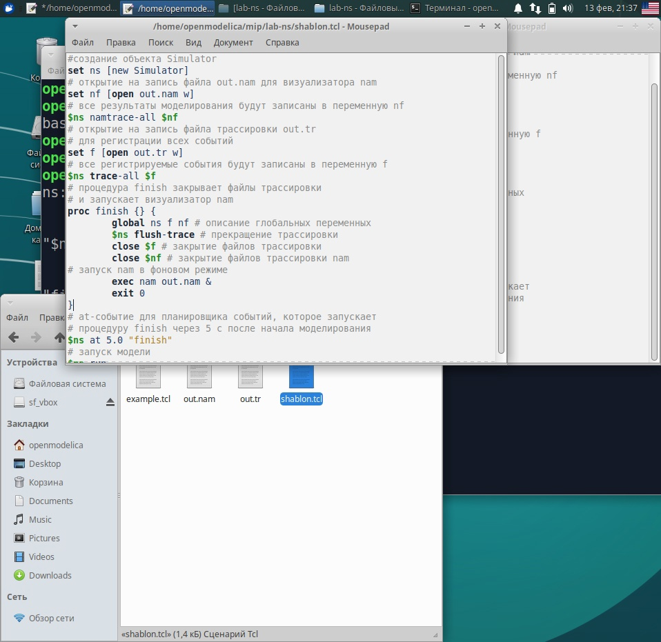
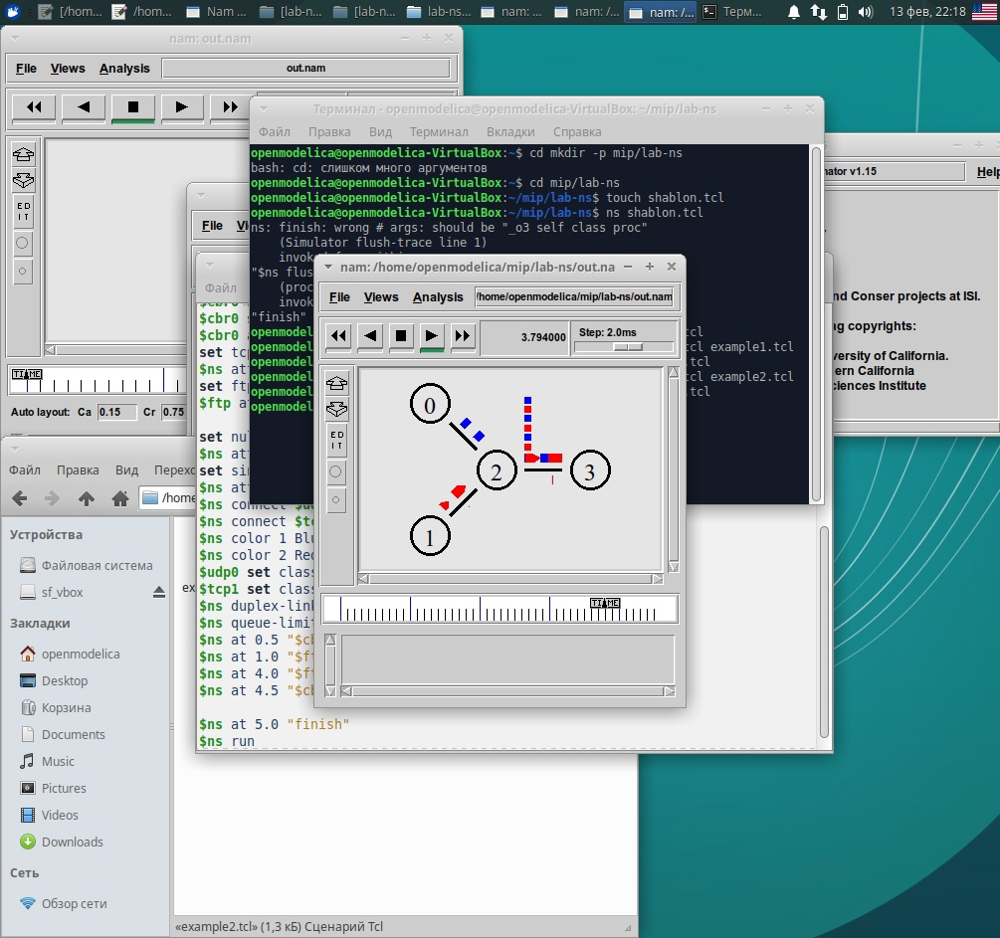

---
## Front matter
lang: ru-RU
title: Лабораторная работа 1
subtitle: Простые модели компьютерной сети
author:
  - Гузева И.Н.
institute:
  - Российский университет дружбы народов, Москва, Россия

## i18n babel
babel-lang: russian
babel-otherlangs: english

## Formatting pdf
toc: false
toc-title: Содержание
slide_level: 2
aspectratio: 169
section-titles: true
theme: metropolis
header-includes:
 - \metroset{progressbar=frametitle,sectionpage=progressbar,numbering=fraction}
 - '\makeatletter'
 - '\beamer@ignorenonframefalse'
 - '\makeatother'
---

# Информация

## Докладчик

:::::::::::::: {.columns align=center}
::: {.column width="70%"}

  * Гузева Ирина Николаевна
  * студентка НФИбд-01-22
  * Российский университет дружбы народов
  * [1032216453@pfur.ru](mailto:1032216453@pfur.ru)
  * <https://dmbelicheva.github.io/ru/>

:::
::: {.column width="25%"}

## Цель работы

Приобрести навыки моделирования сетей передачи данных с помощью средства имитационного моделирования NS-2, а также проанализировать полученные результаты моделирования.

## Задание

1. Создать шаблон сценария для NS-2;
2. Выполнить простой пример описания топологии сети, состоящей из двух узлов и одного соединения;
3. Выполнить пример с усложнённой топологией сети;
4. Выполнить пример с кольцевой топологией сети;
5. Выполнить упражнение.

# Выполнение лабораторной работы

## Шаблон сценария для NS-2

{#fig:001 width=40%}

## Шаблон сценария для NS-2

{#fig:002 width=40%}

## Шаблон сценария для NS-2

{#fig:003 width=40%}

## Пример с усложнённой топологией сети

{#fig:004 width=40%}

## Пример с кольцевой топологией сети

{#fig:005 width=40%}

## Пример с кольцевой топологией сети

{#fig:006 width=40%}

## Упражнение с изменением кольцевой топологией сети

{#fig:007 width=40%}

## Упражнение с изменением кольцевой топологией сети

{#fig:008 width=40%}

## Выводы

В процессе выполнения данной лабораторной работы я приобрела навыки моделирования сетей передачи данных с помощью средства имитационного моделирования NS-2, а также проанализировала полученные результаты моделирования.

