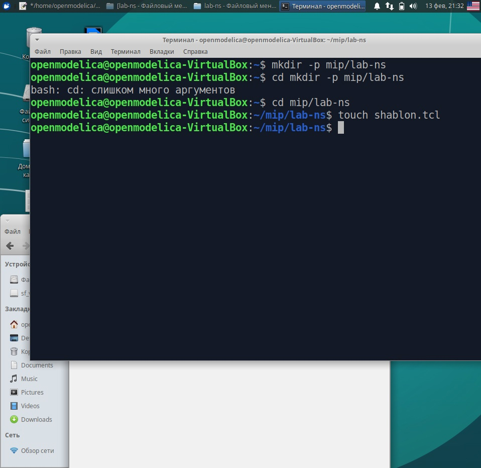
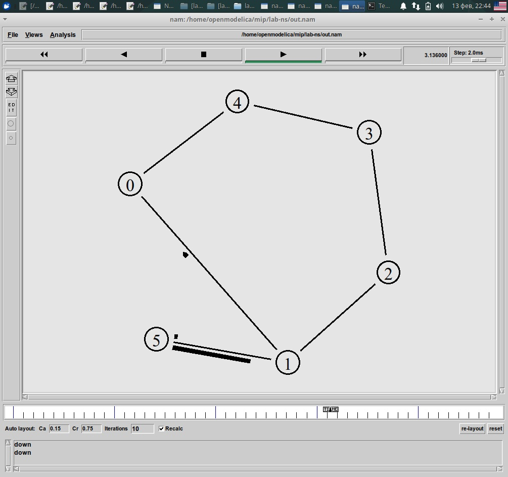

---
## Front matter
title: "Лабораторная работа 1"
subtitle: "Простые модели компьютерной сети"
author: "Гузева Ирина Николаевна"

## Generic otions
lang: ru-RU
toc-title: "Содержание"

## Bibliography
bibliography: bib/cite.bib
csl: pandoc/csl/gost-r-7-0-5-2008-numeric.csl

## Pdf output format
toc: true # Table of contents
toc-depth: 2
lof: true # List of figures
lot: true # List of tables
fontsize: 12pt
linestretch: 1.5
papersize: a4
documentclass: scrreprt
## I18n polyglossia
polyglossia-lang:
  name: russian
  options:
	- spelling=modern
	- babelshorthands=true
polyglossia-otherlangs:
  name: english
## I18n babel
babel-lang: russian
babel-otherlangs: english
## Fonts
mainfont: IBM Plex Serif
romanfont: IBM Plex Serif
sansfont: IBM Plex Sans
monofont: IBM Plex Mono
mathfont: STIX Two Math
mainfontoptions: Ligatures=Common,Ligatures=TeX,Scale=0.94
romanfontoptions: Ligatures=Common,Ligatures=TeX,Scale=0.94
sansfontoptions: Ligatures=Common,Ligatures=TeX,Scale=MatchLowercase,Scale=0.94
monofontoptions: Scale=MatchLowercase,Scale=0.94,FakeStretch=0.9
mathfontoptions:
## Biblatex
biblatex: true
biblio-style: "gost-numeric"
biblatexoptions:
  - parentracker=true
  - backend=biber
  - hyperref=auto
  - language=auto
  - autolang=other*
  - citestyle=gost-numeric
## Pandoc-crossref LaTeX customization
figureTitle: "Рис."
tableTitle: "Таблица"
listingTitle: "Листинг"
lofTitle: "Список иллюстраций"
lotTitle: "Список таблиц"
lolTitle: "Листинги"
## Misc options
indent: true
header-includes:
  - \usepackage{indentfirst}
  - \usepackage{float} # keep figures where there are in the text
  - \floatplacement{figure}{H} # keep figures where there are in the text
---

# Цель работы

Приобретение навыков моделирования сетей передачи данных с помощью средства имитационного моделирования NS-2, а также анализ полученных результатов
моделировани

# Задание

1. Создать шаблон сценария для NS-2;
2. Выполнить простой пример описания топологии сети, состоящей из двух узлов и одного соединения;
3. Выполнить пример с усложнённой топологией сети;
4. Выполнить пример с кольцевой топологией сети;
5. Выполнить упражнение.

# Выполнение лабораторной работы

## Шаблон сценария для NS-2

В своём рабочем каталоге создадим директорию mip, в которой будут выполняться лабораторные работы. Внутри mip создадим директорию lab-ns, а в ней файл shablon.tcl (рис. [-@fig:001]).

{#fig:001 width=70%}

Откроем на редактирование файл shablon.tcl (рис. [-@fig:002]).

Сначала создадим объект типа Simulator. Затем создадим переменную nf и укажем, что требуется открыть на запись nam-файл для регистрации выходных результатов моделирования. Вторая строка даёт команду симулятору записывать все данные о динамике модели
в файл out.nam. Далее создадим переменную f и откроем на запись файл трассировки для регистрации всех событий модели. После этого добавим процедуру finish, которая закрывает файлы трассировки
и запускает nam. С помощью команды at указываем планировщику событий, что процедуру finish запустим через 5 с после начала моделирования, после чего запустим симулятор ns.

{#fig:002 width=70%}
Сохранив изменения в отредактированном файле shablon.tcl и закрыв его, запустим симулятор командой `ns shablon.tcl`. Увидим пустую область моделирования, поскольку ещё не определены никакие объекты и действия (рис. [-@fig:003]).

{#fig:003 width=70%}

## Простой пример описания топологии сети, состоящей из двух узлов и одного соединения

Требуется смоделировать сеть передачи данных, состоящую
из двух узлов, соединённых дуплексной линией связи с полосой пропускания 2
Мб/с и задержкой 10 мс, очередью с обслуживанием типа DropTail. От одного узла
к другому по протоколу UDP осуществляется передача пакетов, размером 500 байт,
с постоянной скоростью 200 пакетов в секунду.

Скопируем содержимое созданного шаблона в новый файл:
`cp shablon.tcl example1.tcl`
и откроем example1.tcl на редактирование. Добавим в него до строки
`$ns at 5.0 "finish"` описание топологии сети. Создадим агенты для генерации и приёма трафика. Создается агент UDP и присоединяется к узлу n0. В узле агент сам не может
генерировать трафик, он лишь реализует протоколы и алгоритмы транспортного
уровня. Поэтому к агенту присоединяется приложение. В данном случае — это источник с постоянной скоростью (Constant Bit Rate, CBR), который каждые 5 мс
посылает пакет R = 500 байт. Таким образом, скорость источника: $R=\dfrac{500\cdot 8}{0.005} = 800000 \, \, бит/с$.

Далее создадим Null-агент, который работает как приёмник трафика, и прикрепим его к узлу n1. Соединим агенты между собой. Для запуска и остановки приложения CBR добавляются at-события в планировщик событий (перед командой $ns at 5.0 "finish") 
Сохранив изменения в отредактированном файле и запустив симулятор, получим в качестве результата запуск аниматора nam в фоновом режиме.
При нажатии на кнопку play в окне nam через 0.5 секунды из узла 0 данные начнут
поступать к узлу 1. 

## Пример с усложнённой топологией сети

**Описание моделируемой сети:**

- сеть состоит из 4 узлов (n0, n1, n2, n3);
- между узлами n0 и n2, n1 и n2 установлено дуплексное соединение с пропускной
способностью 2 Мбит/с и задержкой 10 мс;
- между узлами n2 и n3 установлено дуплексное соединение с пропускной способностью 1,7 Мбит/с и задержкой 20 мс;
- каждый узел использует очередь с дисциплиной DropTail для накопления пакетов,
максимальный размер которой составляет 10;
- TCP-источник на узле n0 подключается к TCP-приёмнику на узле n3
(по-умолчанию, максимальный размер пакета, который TCP-агент может генерировать, равняется 1KByte)
- TCP-приёмник генерирует и отправляет ACK пакеты отправителю и откидывает полученные пакеты;
- UDP-агент, который подсоединён к узлу n1, подключён к null-агенту на узле n3
(null-агент просто откидывает пакеты);
- генераторы трафика ftp и cbr прикреплены к TCP и UDP агентам соответственно;
- генератор cbr генерирует пакеты размером 1 Кбайт со скоростью 1 Мбит/с;
- работа cbr начинается в 0,1 секунду и прекращается в 4,5 секунды, а ftp начинает работать в 1,0 секунду и прекращает в 4,0 секунды.

Скопируем содержимое созданного шаблона в новый файл:
`cp shablon.tcl example2.tcl`
и откроем example2.tcl на редактирование.
Создадим 4 узла и 3 дуплексных соединения с указанием направления.
Создадим агент UDP с прикреплённым к нему источником CBR и агент TCP
с прикреплённым к нему приложением FTP.
Создадим агенты-получатели. Соединим агенты udp0 и tcp1 и их получателей. Зададим описание цвета каждого потока. Выполним отслеживание событий в очереди и наложение ограничения на размер очереди. Добавим at-события.
Сохранив изменения в отредактированном файле и запустив симулятор, получим анимированный результат моделирования (рис. [-@fig:004]).

{#fig:004 width=70%}

## Пример с кольцевой топологией сети

**Описание модели передачи данных по сети с кольцевой топологией и динамической маршрутизацией пакетов:**

- сеть состоит из 7 узлов, соединённых в кольцо;
- данные передаются от узла n(0) к узлу n(3) по кратчайшему пути;
- с 1 по 2 секунду модельного времени происходит разрыв соединения между
узлами n(1) и n(2);
- при разрыве соединения маршрут передачи данных должен измениться на резервный.

Скопируем содержимое созданного шаблона в новый файл:
`cp shablon.tcl example3.tcl`
и откроем example3.tcl на редактирование.
Опишем топологию моделируемой сети. Далее соединим узлы так, чтобы создать круговую топологию. Каждый узел, за исключением последнего, соединяется со следующим, последний
соединяется с первым. Для этого в цикле использован оператор %, означающий
остаток от деления нацело.
Зададим передачу данных от узла n(0) к узлу n(3). Данные передаются по кратчайшему маршруту от узла n(0) к узлу n(3), через узлы n(1) и n(2) (рис. [-@fig:005]).
Добавим команду разрыва соединения между узлами n(1) и n(2) на время в одну
секунду, а также время начала и окончания передачи данных. 

{#fig:005 width=70%}

Добавив в начало скрипта после команды создания объекта Simulator:

`$ns rtproto DV`

увидим, что сразу после запуска в сети отправляется небольшое количество
маленьких пакетов, используемых для обмена информацией, необходимой для маршрутизации между узлами (рис. [-@fig:006]). Когда соединение будет разорвано, информация
о топологии будет обновлена, и пакеты будут отсылаться по новому маршруту через
узлы n(6), n(5) и n(4).

{#fig:006 width=70%}

**Упражнение** 

Внесем следующие изменения в реализацию примера с кольцевой
топологией сети:

- передача данных должна осуществляться от узла n(0) до узла n(5) по кратчайшему пути в течение 5 секунд модельного времени;
- передача данных должна идти по протоколу TCP (тип Newreno), на принимающей стороне используется TCPSink-объект типа DelAck; поверх TCP работает
протокол FTP с 0,5 до 4,5 секунд модельного времени;
- с 1 по 2 секунду модельного времени происходит разрыв соединения между
узлами n(0) и n(1);
- при разрыве соединения маршрут передачи данных должен измениться на резервный, после восстановления соединения пакеты снова должны пойти по
кратчайшему пути.

Изменим количество узлов в кольце на 5, а 6 узел n(5) отдельно присоединим к
узлу n(1). 
Вместо агента UDP создадим агента TCP (типа Newreno), а на принимающей
стороне используем TCPSink-объект типа DelAck; поверх TCP работает протокол
FTP с 0,5 до 4,5 секунд модельного времени Также зададим с 1 по 2 секунду
модельного времени разрыв соединения между узлами n(0) и n(1)([-@fig:007]).

{#fig:007 width=70%}

Запустим программу и увидим, что пакеты идут по кратчайшему пути через узел
n(1) ([-@fig:008]).

{#fig:008 width=70%}

# Выводы

В процессе выполнения данной лабораторной работы я приобрела навыки моделирования сетей передачи данных с помощью средства имитационного моделирования NS-2, а также проанализировала полученные результаты моделирования.
